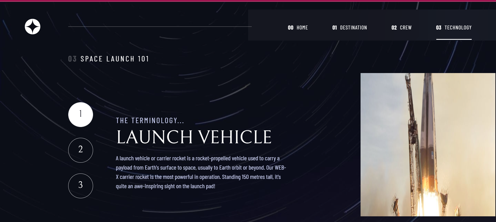

# Frontend Mentor - Space tourism website solution

This is a solution to the [Space tourism website challenge on Frontend Mentor](https://www.frontendmentor.io/challenges/space-tourism-multipage-website-gRWj1URZ3). Frontend Mentor challenges help you improve your coding skills by building realistic projects. 

## Table of contents

- [Overview](#overview)
  - [The challenge](#the-challenge)
  - [Screenshot](#screenshot)
  - [Links](#links)
- [My process](#my-process)
  - [Built with](#built-with)
  - [What I learned](#what-i-learned)
  - [Continued development](#continued-development)
  - [Useful resources](#useful-resources)
- [Author](#author)
- [Acknowledgments](#acknowledgments)


## Overview

### The challenge

Users should be able to:

- View the optimal layout for each of the website's pages depending on their device's screen size
- See hover states for all interactive elements on the page
- View each page and be able to toggle between the tabs to see new information

### Screenshot



### Links

- Solution URL: (https://www.frontendmentor.io/solutions/spacetourismwebsite-challenge-N3utmdbZBE)
- Live Site URL: (https://space-tourism-site-psi.vercel.app/)

## My process

### Built with

- Semantic HTML5 markup
- CSS custom properties
- Flexbox
- CSS Grid
- Mobile-first workflow
- [React](https://reactjs.org/) - JS library
- [Framer-Motion](https://www.framer.com/motion/) - Animation Library
- [Tailwind-Css](https://tailwindcss.com/) - For styles

### What I learned

```From this project, I was able to dive into framer-motion for the first time and I really enjoyed it. Furthermore, I got better in using tailwind-css, now I don't have to look up the name for every class in their docs.

### Continued development
I want to go into advanced react and learn some best react practices, also I'm going to practice more to make my code more dynamic and dry.

## Author

- Website - [In progress...](``I'm still working on my portfolio``)
- Frontend Mentor - [@emmaGH1](https://www.frontendmentor.io/profile/emmaGH1)
- Twitter - [@_HEISEMMA](https://www.twitter.com/HEISEMMA)


